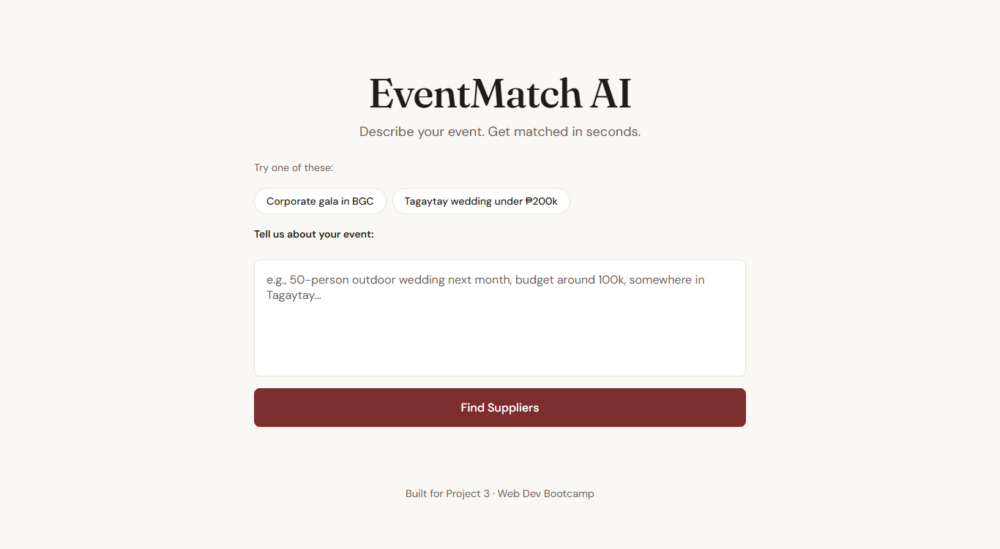

# EventMatch AI

**Project 3 — Web Development Bootcamp**

An AI-powered web app that helps event organizers in the Philippines describe their event in plain language and get matched with relevant suppliers, with AI-generated reasoning for each match.

🔗 **Live demo:** https://eventmatch-ai.netlify.app/



## Project overview

EventMatch AI is the third project of my web development bootcamp — a one-week build that takes the supplier database concept from Project 1 (console CRUD) and reimagines it as a natural-language AI interface. Instead of browsing a static list, users describe an event in plain words and receive suppliers matched with reasoning.

## User stories

1. As an event organizer, I want to describe my event in natural language so I don't have to know what categories or filters to set.
2. As an event organizer, I want to see why each supplier was recommended so I can trust the match and make a decision.
3. As an event organizer, I want hard constraints like allergies, dietary needs, and guest count to always be respected.
4. As an event organizer, I want flexible constraints like preferred location or budget to be relaxed when no exact match exists — but I want to be told when that substitution happens.
5. As an event organizer, I want to ask for multiple options per category so I can compare suppliers.

## Features

- Natural language event input with AI-reasoned supplier matches
- Hard vs soft constraint handling (allergies/dietary/guest count never bent; location/budget substituted with explicit acknowledgment in the summary)
- Top-N per category triggered by natural language ("give me 3 venues", "a few catering options") — returns up to 3 matches in the requested category
- Five preset sample prompts for quick testing
- End-to-end error surfacing — upstream Gemini errors propagate through the Netlify function to the UI instead of collapsing into a generic message

## Tech stack

- **Frontend:** Vanilla HTML, CSS, JavaScript (no framework)
- **AI:** Google Gemini 2.5 Flash via REST API
- **Backend:** Netlify Functions (serverless) — keeps the API key off the client
- **Deployment:** Netlify (continuous deploy from the GitHub mirror)
- **Data:** Local JSON file with ~25 fictional Philippine suppliers across categories (venues, catering, lights & sound, photography, florists, entertainment)

## Run locally

Requires [Node.js](https://nodejs.org), the [Netlify CLI](https://docs.netlify.com/cli/get-started/), and a free [Google Gemini API key](https://aistudio.google.com/apikey).

1. Clone and navigate into this project:
   ```bash
   git clone https://gitlab.com/<your-username>/<repo-name>.git
   cd <repo-name>/p3-js-api-app
   ```

2. Create a `.env` file in `p3-js-api-app/`:
   ```
   GEMINI_API_KEY=your_key_here
   ```

3. Start the local dev server (serves static files and the serverless function together):
   ```bash
   netlify dev
   ```

4. Open the URL Netlify prints (usually `http://localhost:8888`).

## Repository setup

- **GitLab (this repo):** bootcamp source of truth
- **GitHub mirror:** powers the live Netlify deployment

## Known limitations

- Mock supplier data (not connected to a real source)
- Free-tier Gemini API quota limits daily requests
- Prompt and supplier set are Philippine-specific