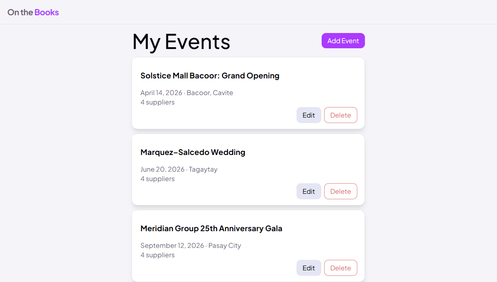

# On The Books

**Project 5 — Web Development Bootcamp**

An event organizer's command center for managing supplier bookings across multiple events — with per-event budgets, booking statuses, and AI-suggested suppliers to fill the gaps.

🔗 **Live app:** https://onthebooks-fullstack.onrender.com
🔗 **Live API:** https://onthebooks-backend.onrender.com

> ⏳ Hosted on Render's free tier — the API spins down after inactivity, so the first request may take up to a minute to respond.



## Project overview

On The Books is an event organizer's command center for managing supplier bookings across multiple events. This project is the backend API, built with Node, Express, and MongoDB, providing persistent data, user authentication, authorization, and AI-powered supplier recommendations. It replaces the `localStorage` persistence used by the Project 4 React front end, which is included here in `client/` and deployed alongside it.

The API is built around four resources: Users own Events, Suppliers form a shared pool, and Arrangements connect Suppliers to Events. An Arrangement stores what is specific to that booking, such as the negotiated budget, booking status, and notes. The core design decision is that a supplier's name and category belong to the supplier, while "quoted ₱45,000, status declined" belongs to the arrangement.

## User stories

1. As an event organizer, I want to register and log in, so that my events are private to me and persist across devices.
2. As an event organizer, I want my data protected behind my login, so that no other user can read or change it.
3. As an event organizer, I want to view and deactivate my own account, so that I control my presence in the system.
4. As an event organizer, I want to create, view, update, and deactivate events, so that I have a dedicated space to track suppliers for each one.
5. As an event organizer, I want to add suppliers to a shared pool, so that vendors I have worked with are available to reuse across my events.
6. As an event organizer, I want to attach suppliers to a specific event with their own budget and status, so that I can track what each vendor costs and where each booking stands for that event.
7. As an event organizer, I want the system to suggest suppliers for an event, so that I can fill gaps in my shortlist without searching the whole pool myself.
8. As an event organizer, I want to filter the supplier pool by category, so that I can find candidates for a specific need without scrolling the whole list.

## Features

- **Authentication** — register with a username and password, hashed with bcrypt in a Mongoose pre-save hook and never returned in any response. Login issues a JSON Web Token; every route except register and login requires a valid Bearer token.
- **Ownership scoping** — events are scoped to their owner, and the check is folded into the query itself rather than run after the fact. Requesting another user's event returns **404, not 403**, so the API never confirms that a record it won't show you exists.
- **Event management** — create, read, update, and soft-delete events, each carrying a name, date, venue, and overall budget.
- **Shared supplier pool** — create, read, update, and soft-delete suppliers. Category is constrained to twelve fixed values, never free text.
- **Arrangements** — attach a supplier to an event with its own budget, status, and notes. Reads populate the supplier's name, category, and contact alongside the arrangement's own fields, so the client renders a complete card in a single request. Arrangements whose supplier has been deactivated are excluded.
- **Soft delete everywhere except one place** — Users, Events, and Suppliers flip an `isActive` flag; Arrangements are hard-deleted, which gives the API one true `DELETE` verb.
- **AI supplier recommendations** — a per-event endpoint that reads the event's existing arrangements first, so it can suggest replacements for suppliers who declined and flag categories the event hasn't covered yet. Nothing it returns is persisted.
- **Graceful AI degradation** — the deterministic gap analysis and the AI ranking are separate layers, so a Gemini outage returns 200 with the gap analysis intact and `suggestions: null` rather than a 500.
- **Category filtering** — `GET /suppliers?category=catering` narrows the pool; an unrecognized category returns an empty array rather than an error.
- **Centralized error handling** — one error middleware maps Mongoose validation, cast, and duplicate-key errors to the right status codes, with a `notFound` handler mounted after all routes.

## Tech stack

| Layer                 | Technology                               |
| --------------------- | ---------------------------------------- |
| Runtime               | Node.js                                  |
| Framework             | Express 5                                |
| Database              | MongoDB Atlas                            |
| ODM                   | Mongoose 9                               |
| Authentication        | JSON Web Tokens (`jsonwebtoken`)         |
| Password hashing      | `bcryptjs`                               |
| AI recommendations    | Google Gemini 2.5 Flash (native `fetch`) |
| Security / middleware | `cors`, `helmet`, `dotenv`               |
| Frontend              | React (Vite), React Router, `useReducer` |
| Deployment            | Render (Web Service + Static Site)       |

## Data model

```
User ──< Event ──< Arrangement >── Supplier
```

| Resource        | Key fields                                                       | Delete behavior                            |
| --------------- | ---------------------------------------------------------------- | ------------------------------------------ |
| **User**        | `username`, `password` (hashed), `isActive`                      | Soft — `PUT /users/me` sets `isActive` false |
| **Event**       | `name`, `date`, `venue`, `budget`, `ownerId`, `isActive`         | Soft                                       |
| **Supplier**    | `name`, `category` (enum of 12), `contact`, `isActive`           | Soft — affects every user                  |
| **Arrangement** | `eventId`, `supplierId`, `budget`, `status` (enum of 4), `notes` | Hard                                       |

Arrangement is a junction with its own attributes rather than a plain join table, which is why the same supplier can appear under several events, each with its own budget and status.

Budget lives at two levels for the same reason. The **event** carries the total the organizer has to work with; each **arrangement** carries what one supplier costs at that event. The ceiling belongs to the event, the line items belong to the arrangements.

The full ERD is in [`docs/`](./docs).

## API endpoints

All routes are prefixed with `/api/v1`. Every route except register and login
requires a valid JWT sent as `Authorization: Bearer <token>`.

### Authentication

| #   | Method | Endpoint         | Description                             | Status codes    |
| --- | ------ | ---------------- | --------------------------------------- | --------------- |
| 1   | POST   | `/auth/register` | Creates a user with a hashed password.  | 201 · 400 · 409 |
| 2   | POST   | `/auth/login`    | Verifies credentials and returns a JWT. | 200 · 400 · 401 |

### Users

| #   | Method | Endpoint    | Description                                                             | Status codes |
| --- | ------ | ----------- | ----------------------------------------------------------------------- | ------------ |
| 3   | GET    | `/users/me` | Returns the logged-in user, identified from the token.                  | 200 · 401    |
| 4   | PUT    | `/users/me` | Updates the account, or soft deletes it by setting `isActive` to false. | 200 · 401    |

### Events

| #   | Method | Endpoint                           | Description                                                                                                                               | Status codes          |
| --- | ------ | ---------------------------------- | ----------------------------------------------------------------------------------------------------------------------------------------- | --------------------- |
| 5   | GET    | `/events`                          | Returns all active events owned by the logged-in user.                                                                                    | 200 · 401             |
| 6   | POST   | `/events`                          | Creates an event owned by the logged-in user.                                                                                             | 201 · 400 · 401       |
| 7   | GET    | `/events/:id`                      | Returns a single active event.                                                                                                            | 200 · 401 · 404       |
| 8   | PUT    | `/events/:id`                      | Edits an event, or soft deletes it by setting `isActive` to false.                                                                        | 200 · 400 · 401 · 404 |
| 9   | POST   | `/events/:eventId/recommendations` | Takes a plain-language description and returns AI-recommended suppliers, informed by the event's existing arrangements. Nothing is saved. | 200 · 400 · 401 · 404 |

### Arrangements

| #   | Method | Endpoint                            | Description                                                                                                    | Status codes          |
| --- | ------ | ----------------------------------- | -------------------------------------------------------------------------------------------------------------- | --------------------- |
| 10  | GET    | `/events/:eventId/arrangements`     | Returns the event's arrangements with supplier details populated.                                              | 200 · 401 · 404       |
| 11  | POST   | `/events/:eventId/arrangements`     | Creates an arrangement linking a supplier to the event.                                                        | 201 · 400 · 401 · 404 |
| 12  | PUT    | `/events/:eventId/arrangements/:id` | Edits the budget, status, or notes for that supplier at that event.                                            | 200 · 400 · 401 · 404 |
| 13  | DELETE | `/events/:eventId/arrangements/:id` | Permanently removes the arrangement and returns the deleted document. The supplier record itself is untouched. | 200 · 401 · 404       |

### Suppliers

| #   | Method | Endpoint         | Description                                                                                            | Status codes          |
| --- | ------ | ---------------- | ------------------------------------------------------------------------------------------------------ | --------------------- |
| 14  | GET    | `/suppliers`     | Returns all active suppliers from the shared pool. Optional `?category=` filters by category.          | 200 · 401             |
| 15  | POST   | `/suppliers`     | Adds a supplier to the shared pool.                                                                    | 201 · 400 · 401       |
| 16  | PUT    | `/suppliers/:id` | Edits a supplier, or soft deletes it by setting `isActive` to false. Affects all users and all events. | 200 · 400 · 401 · 404 |

### Notes on the endpoint design

- **Endpoints 2 and 9 are reads that use POST.** Both send a payload in the
  request body and neither creates a stored record; GET requests cannot carry
  a body.
- **Endpoint 13 is the only hard delete.** Arrangement has no `isActive` field
  by design — removing a supplier from an event's shortlist is a correction,
  not something that needs recovery. It returns **200 with the deleted
  document** rather than 204, so the client can confirm exactly what was
  removed.
- **Suppliers are a shared pool with no `ownerId`,** so endpoint 16 affects
  every user. This is a deliberate tradeoff: in the events industry the same
  suppliers circulate among producers, so whoever learns of a change first
  updates it for everyone.
- **The recommendations endpoint degrades gracefully.** If the AI provider
  fails or times out, the endpoint still returns 200 with `suggestions: null`
  rather than a 500, so a third-party outage never breaks the page.
- **Constrained values.** `category` accepts twelve fixed values and `status`
  accepts four — `contacted`, `quoted`, `booked`, `declined`. Anything outside
  those sets is rejected with 400.

## Project structure

```
p5-backend-node-app/
├── client/                          # React frontend (Vite)
│   ├── public/
│   ├── src/
│   ├── index.html
│   └── vite.config.js
├── config/
│   └── db.js                        # Mongoose connection
├── controllers/
│   ├── arrangementController.js
│   ├── authController.js
│   ├── eventController.js
│   ├── recommendationController.js
│   ├── supplierController.js
│   └── userController.js
├── docs/                            # Planning artifacts — proposal, ERD
├── middleware/
│   ├── authMiddleware.js            # Protects routes, attaches req.user
│   └── errorMiddleware.js           # Centralized error handling
├── models/
│   ├── Arrangement.js
│   ├── Event.js
│   ├── Supplier.js
│   └── User.js
├── routes/
│   ├── arrangementRoutes.js
│   ├── authRoutes.js
│   ├── eventRoutes.js
│   ├── recommendationRoutes.js
│   ├── supplierRoutes.js
│   └── userRoutes.js
├── utilities/
│   ├── generateToken.js
│   ├── getSuggestions.js            # Gemini API call
│   └── verifyToken.js
├── .env.example
├── .prettierrc
├── package.json
└── server.js
```

### Why the code is separated this way — MVC

This project follows the MVC (Model-View-Controller) pattern. Routes handle
the URL, controllers hold the logic, models define the schema, middleware runs
before the controller, and utilities provide reusable helpers. This separation
keeps each part of the API focused on one responsibility.

- **`models/`** — The M. Mongoose schemas define what a valid document looks
  like, including enums and the pre-save password hashing hook.
- **`controllers/`** — The C. Controllers handle what actually happens on a
  request: database queries, ownership checks, and response shapes.
- **`routes/`** — The URL surface. Routes map HTTP methods and paths to
  controllers and apply authentication middleware. No business logic lives here.
- **`middleware/`** — Cross-cutting concerns that run across routes, including
  JWT verification and centralized error handling.
- **`utilities/`** — Reusable helpers that have no knowledge of the
  request/response cycle.

The payoff is that changes stay localized. For example, changing how an
endpoint responds or adjusting its status code can be handled inside its
controller without changing the route, model, or middleware around it. The AI
recommendation endpoint also works with the same Event, Supplier, and
Arrangement models as the rest of the API rather than introducing a separate
data layer.

There is no V in this repository because the view is handled by the React
client; this project is focused on the backend API.

## Environment variables

Create a `.env` file in the project root. Never commit it.

| Variable         | Description                                                                                                                                                                                |
| ---------------- | ------------------------------------------------------------------------------------------------------------------------------------------------------------------------------------------ |
| `PORT`           | Port the Express server listens on (e.g. `8000`)                                                                                                                                           |
| `MONGODB_URI`    | MongoDB connection string. Uses the **non-SRV** format — SRV lookups fail on some networks.                                                                                                |
| `JWT_SECRET`     | Secret used to sign JSON Web Tokens. Generate one with:<br>`node -e "console.log(require('crypto').randomBytes(64).toString('hex'))"`                                                      |
| `JWT_EXPIRES_IN` | Token lifetime (e.g. `7d`)                                                                                                                                                                 |
| `GEMINI_API_KEY` | Google Gemini API key for the recommendations endpoint                                                                                                                                     |
| `CLIENT_URL`     | Frontend origin, used for the CORS allowlist. `http://localhost:5173` in development; the deployed frontend URL in production. Must have **no trailing slash** — origin matching is exact. |

The frontend needs one of its own, in `client/.env`:

| Variable       | Description                                                                                                                            |
| -------------- | -------------------------------------------------------------------------------------------------------------------------------------- |
| `VITE_API_URL` | Full API base, e.g. `http://localhost:8000/api/v1`. Vite bakes this in at **build** time, so changing it in production needs a rebuild. |

## Getting started

### Prerequisites

- Node.js 18 or higher (the API uses the global `fetch`, available from 18)
- A MongoDB Atlas cluster (or a local MongoDB instance)
- A Google Gemini API key

### Installation

```bash
# Clone the repository and check out the project branch
git clone <repo-url>
cd <repo-name>
git checkout p5-backend-node-app
cd p5-backend-node-app

# Install backend dependencies
npm install

# Create your environment file (see Environment variables above)
cp .env.example .env

# Start the API in development
npm run dev
```

The API runs at `http://localhost:8000`. A `GET /` returns a health-check message.

### Running the frontend

```bash
cd client
npm install
npm run dev
```

The React app runs at `http://localhost:5173` — which must match `CLIENT_URL` in the backend `.env`, or CORS will block every request.

## Repository setup

- **GitLab:** bootcamp source of truth, on branch `p5-backend-node-app`
- **GitHub:** public mirror, and the source both Render services build from
- **Render — Web Service:** Root Directory `p5-backend-node-app`, build `npm install`, start `npm start`
- **Render — Static Site:** Root Directory `p5-backend-node-app/client`, build `npm run build`, publish `dist`, with a rewrite rule `/*` → `/index.html` so client-side routes survive a hard refresh
- **MongoDB Atlas:** Network Access set to `0.0.0.0/0`, since Render's free tier has no static outbound IP

## Known limitations and design tradeoffs

Most of the following are deliberate tradeoffs in the current scope and data
model rather than unknown gaps. The exception is the first one, which is a
genuine defect with a fix already written.

- **Arrangement endpoints don't verify parent-event ownership.** Events are
  correctly scoped to their owner, but the arrangement handlers on this branch
  look up records by `_id` alone, without confirming that the parent event
  belongs to the caller. A user holding a valid token and another user's
  arrangement ID can read, edit, or delete it. The fix — a
  `verifyEventOwnership` middleware, plus filtering on both `_id` and
  `eventId` so the query itself enforces the boundary rather than an `if`
  after the fact — lives on the `p5-backend-node-app-fixes` branch, pending
  review.

- **Shared supplier pool, no per-user ownership.** Suppliers do not have an
  `ownerId`, so any authenticated user can create or edit any supplier in the
  shared pool. This is intentional: suppliers are treated as organization-wide
  resources rather than user-owned records. The tradeoff is that there is no
  per-user isolation on the supplier collection, and a supplier update is
  visible to all users and any events using that supplier.

- **Add Supplier is not transactional.** Adding a supplier and creating its
  initial arrangement are currently two sequential requests: the supplier is
  created first, followed by the arrangement. If the second request fails, the
  supplier remains in the shared pool without a booking attached. The
  appropriate fix would be to wrap both operations in a MongoDB transaction so
  they either both succeed or both roll back.

- **Create-new supplier flow, no pool picker.** The Add Supplier form currently
  always creates a new supplier rather than allowing the user to select an
  existing supplier from the shared pool. There is also no UI for soft-deleting
  suppliers. As a result, duplicate supplier records can accumulate. This keeps
  the current flow simple, but a future iteration could add supplier selection
  and a management interface for maintaining the shared pool.

- **AI recommendations are API-only, with no UI entry point.** The
  recommendations endpoint is fully implemented, verified in Postman, and
  degrades gracefully when the AI provider fails — but the React client has no
  button or view that calls it. User story 7 is satisfied at the API layer
  only. The frontend was migrated from Project 4, whose scope predates the
  recommendations feature, and the UI for it was not built within the project
  timeline. The endpoint is exercisable directly at
  `POST /api/v1/events/:eventId/recommendations`.

- **Tokens are stored in `localStorage` with no refresh flow.** A token stays
  valid for its full lifetime and cannot be revoked server-side before it
  expires.

- **No pagination or search on list endpoints.** Fine at the scale this was
  built for, not at production scale.

- **No automated test suite.** Endpoints were verified manually in Postman
  across the full CRUD surface, with MongoDB Compass used to confirm what
  actually landed in the database.

## Planning and documentation

Planning artifacts are in [`docs/`](./docs):

- **Project proposal** — user stories with acceptance criteria, feature
  breakdown by priority, and the full endpoint specification
- **ERD** — the four-resource data model and its relationships
- **Trello board** — https://trello.com/b/rUWcCCae/on-the-books-p5-backend-api-node

## Author

Faith Puton — Uplift Code Camp Fullstack Web Development, Batch 29